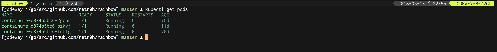

# lolgopher

<p align="center"></p>

Rainbow Writer implementation for Golang

Based on https://github.com/busyloop/lolcat.

 Proudly packaged with Golang [dep](https://github.com/golang/dep)

## Installing

```
$ go get github.com/kris-nova/lolgopher
```

##### From Source

```
cd $GOPATH/src/github.com/kris-nova/lolgopher
go install .
```

## Usage

##### As a library

See the `examples` directory.

##### As a CLI

```
$ function kubectl() { $(which kubectl) $* | lolgopher }
```

<p align="center"></p>
